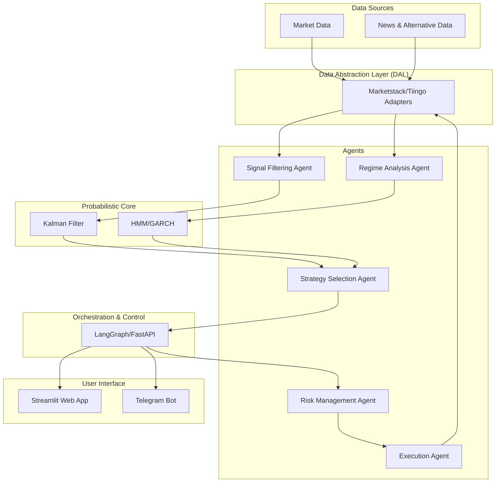

# Architecture Overview

This document provides an overview of the AI Trader application's architecture.

## High-Level System Diagram

```mermaid
graph TD
    subgraph "Data Sources"
        DS1[Market Data]
        DS2[News & Alternative Data]
    end

    subgraph "Data Abstraction Layer (DAL)"
        DAL1[Marketstack/Tiingo Adapters]
    end

    subgraph "Probabilistic Core"
        PC1[Kalman Filter]
        PC2[HMM/GARCH]
    end

    subgraph "Agents"
        A1[Signal Filtering Agent]
        A2[Regime Analysis Agent]
        A3[Strategy Selection Agent]
        A4[Risk Management Agent]
        A5[Execution Agent]
    end

    subgraph "Orchestration & Control"
        OC1[LangGraph/FastAPI]
    end

    subgraph "User Interface"
        UI1[Streamlit Web App]
        UI2[Telegram Bot]
    end
    
    DS1 --> DAL1
    DS2 --> DAL1
    DAL1 --> A1
    A1 --> PC1
    PC1 --> A3
    DAL1 --> A2
    A2 --> PC2
    PC2 --> A3
    A3 --> OC1
    OC1 --> A4
    A4 --> A5
    A5 --> DAL1
    OC1 --> UI1
    OC1 --> UI2
```