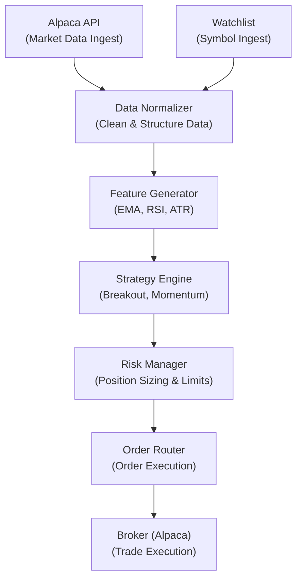

```mermaid
graph TD
  AlpacaAPI["Alpaca API<br/>(Market Data Ingest)"]
  Watchlist["Watchlist<br/>(Symbol Ingest)"]
  DataNormalizer["Data Normalizer<br/>(Clean & Structure Data)"]
  FeatureGen["Feature Generator<br/>(EMA, RSI, ATR)"]
  StrategyEngine["Strategy Engine<br/>(Breakout, Momentum)"]
  RiskManager["Risk Manager<br/>(Position Sizing & Limits)"]
  OrderRouter["Order Router<br/>(Order Execution)"]
  Broker["Broker (Alpaca)<br/>(Trade Execution)"]

  AlpacaAPI --> DataNormalizer
  Watchlist --> DataNormalizer
  DataNormalizer --> FeatureGen
  FeatureGen --> StrategyEngine
  StrategyEngine --> RiskManager
  RiskManager --> OrderRouter
  OrderRouter --> Broker
```
