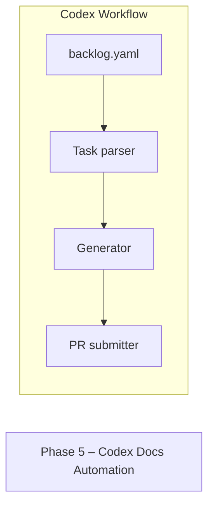

%% PHASE 5 — CODEX DOCS (Documentation Automation & Knowledge System)
%% Owner: Platform/Docs; Status: Draft

---
title: Phase 5 — Codex Docs
---

%% 1) High-level mindmap of the Codex documentation system
mindmap
  root((Codex Docs))
    Goals
      Standardize knowledge
      Automate docs CI/CD
      Keep runbooks current
      Close the loop with incidents
    Sources
      ADRs
      Runbooks
      API Spec (OpenAPI)
      Postmortems
      Architecture Diagrams
      Strategy Specs (Alpha/Momentum/etc.)
      Ops Playbooks
      Parking‑Lot Items
    Destinations
      Repo /docs
      Wiki (GitHub Pages)
      Internal Portal
      Azure Storage (static)
      Telegram release notes
    Automation
      Lint & Link check
      Diagram compile (Mermaid)
      Changelog generation
      Version bump & tag
      Publish artifacts
      Notify channels
    Governance
      Templates & Checklists
      Codeowners Review
      Doc Owners & SLAs
      SLOs for doc freshness

%% 2) End-to-end flow from idea to published docs
flowchart LR
  A[Idea / Change Request] --> B{Doc impact?}
  B -- no --> Z1[No-op; label PR no-doc]
  B -- yes --> C[Create GitHub Issue using "Codex Doc" template]
  C --> D[Write draft in /docs with template]
  D --> E[Open PR with docs + code]
  E --> F[CI: mdformat, link-check, spellcheck]
  F --> G{Pass?}
  G -- no --> D
  G -- yes --> H[Reviewers (CODEOWNERS): arch + product + ops]
  H --> I{Approved?}
  I -- no --> D
  I -- yes --> J[Merge to main]
  J --> K[Release tag (v*) & changelog]
  K --> L[Publish site (Pages/Portal/Storage)]
  L --> M[Notify: Telegram #releases & Azure App Insights annotation]
  M --> N[Set doc freshness TTL label]

%% 3) Documentation lifecycle state machine
stateDiagram-v2
  [*] --> Draft
  Draft --> InReview: PR opened
  InReview --> ChangesRequested
  ChangesRequested --> Draft: author updates
  InReview --> Approved
  Approved --> Published: merged & released
  Published --> Obsolete: superseded or deprecated
  Obsolete --> Archived
  Archived --> [*]
  Published --> Draft: major revision

%% 4) Information architecture (artifacts & relations)
erDiagram
  ADR ||--o{ CHANGE : records
  ADR {
    string id PK
    string title
    string status
    string decision
    string context
    string consequences
  }
  RUNBOOK ||--o{ STEP : contains
  RUNBOOK {
    string id PK
    string service
    string scenario
    string owner
    int    RTO_minutes
    int    RPO_minutes
  }
  POSTMORTEM ||--o{ ACTION : yields
  POSTMORTEM {
    string id PK
    date   incident_date
    string impact
    string root_cause
    string lessons
  }
  API_DOC ||--o{ ENDPOINT : defines
  API_DOC {
    string version PK
    string source
  }
  ACTION {
    string id PK
    string status
    string owner
    date   due
  }

%% 5) CI pipeline for docs
flowchart TB
  subgraph GitHub Actions
    L1[lint-md] --> L2[link-check]
    L2 --> L3[spellcheck]
    L3 --> L4[mermaid-compile]
    L4 --> L5[build-site]
    L5 --> L6[publish]
  end
  subgraph Environments
    DEV[(Preview Pages)]
    PROD[(Prod Docs)]
  end
  L5 --> DEV
  L6 --> PROD
  click L1 href "https://github.com/marketplace/actions/markdownlint-cli2-action" "markdownlint"
  click L2 href "https://github.com/marketplace/actions/link-checker" "link checker"
  click L4 href "https://github.com/marketplace/actions/mermaid-cli-action" "mermaid-cli"

%% 6) Gantt for rollout
gantt
  title Phase 5 Codex Rollout
  dateFormat  YYYY-MM-DD
  section Templates
    Doc templates & checklists      :done,    t1, 2025-10-25, 1d
    ADR template                    :active,  t2, 2025-10-28, 2d
  section Automation
    CI lint/link/spell              :         a1, 2025-10-29, 2d
    Mermaid compile & preview       :         a2, after a1, 1d
    Publish to Pages/Portal         :         a3, after a2, 1d
  section Governance
    CODEOWNERS & ownership map      :         g1, 2025-11-02, 1d
    Freshness SLO & TTL labels      :         g2, 2025-11-03, 1d
  section Adoption
    Backfill key runbooks           :         r1, 2025-11-04, 3d
    Postmortem template live        :         r2, after r1, 1d

%% 7) Doc templates checklist (sequence to verify)
sequenceDiagram
  autonumber
  actor Author
  participant Repo as Repo (/docs)
  participant CI as CI
  participant Reviewer as Reviewer
  Author->>Repo: Add doc using template
  Repo-->>CI: PR opened
  CI->>CI: Lint/Link/Spell/Mermaid
  CI-->>Author: Fail details if any
  Author->>Repo: Fix & push
  CI-->>Reviewer: Pass; request review
  Reviewer->>Repo: Approve / comment
  Repo-->>Repo: Merge; publish
  Repo-->>Author: Confirmation & URL

%% 8) Parking-lot linkage
flowchart LR
  P[Parking-Lot] --> P1[De-dup watchlist routes]
  P --> P2[Alpaca auth/data feed]
  P --> P3[DB DSN reconfiguration]
  P --> P4[Docs: Update architecture.md]
  P --> P5[Observability: SLO dashboards]
