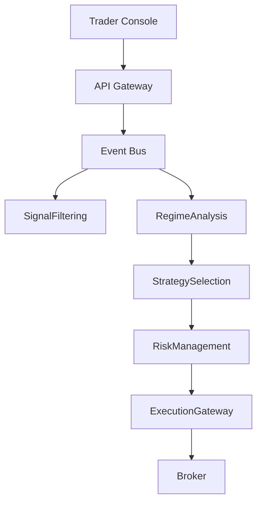
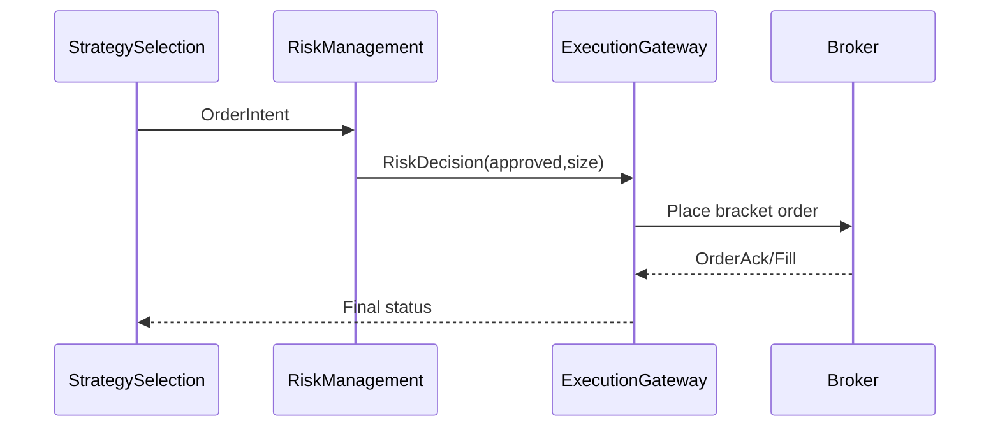

# System Architecture

## Overview
State the system’s purpose, scope, and non-goals in 3–5 sentences.

## Component diagram

## Order lifecycle (sequence)

## Non-functional requirements
List latency budgets, availability/SLOs, and scalability assumptions.

## Failure modes & resilience
Top failures and mitigations (retries, circuit breakers, kill switch, backpressure).

## Dependencies
Key external systems and contracts.

## See also
- [Database Architecture](../reference/database-architecture.md)
- [SRE & SLOs](../reference/sre-slos.md)
- [Deployment Environments](./deployment-environments.md)
