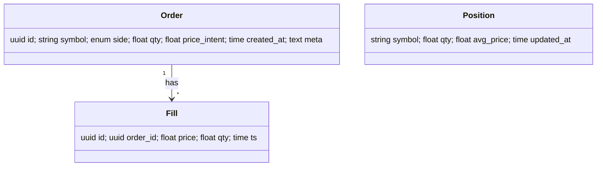

# Database Architecture

## Storage topology
- **Relational (Postgres/Timescale):** orders, fills, positions, runs, metrics
- **Files (Parquet/Delta):** OHLCV, features, backtests
- **Cache (Redis):** online features, queues

## ER diagram

## Indexing & partitions
- Time partitions on `fills.ts`
- B-tree on `orders(symbol, created_at)`
- Table TTL/retention policy

## Backup & restore
- Daily logical backups + weekly snapshots
- PITR window (e.g., 7 days). Restore-tested quarterly

## Migration policy
- Forward-only migrations; idempotent backfills

## See also
- [Data Models](./data-models.md)
- [Operations runbook](../howto/operations/runbook.md)
- [Architecture core runtime](../explanations/architecture/core-runtime.md)
